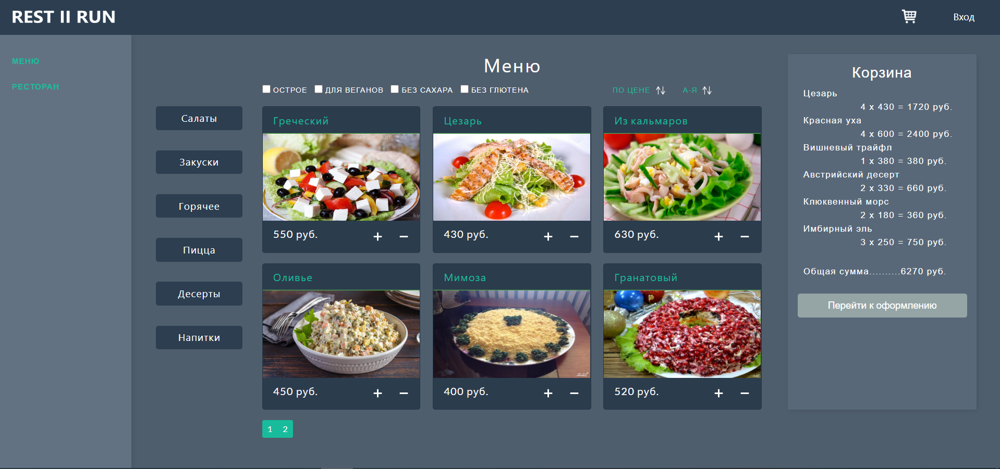
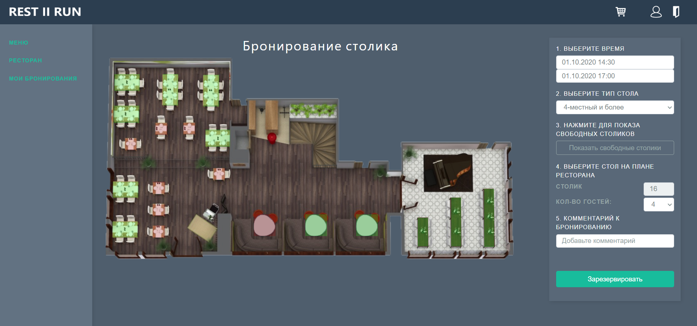
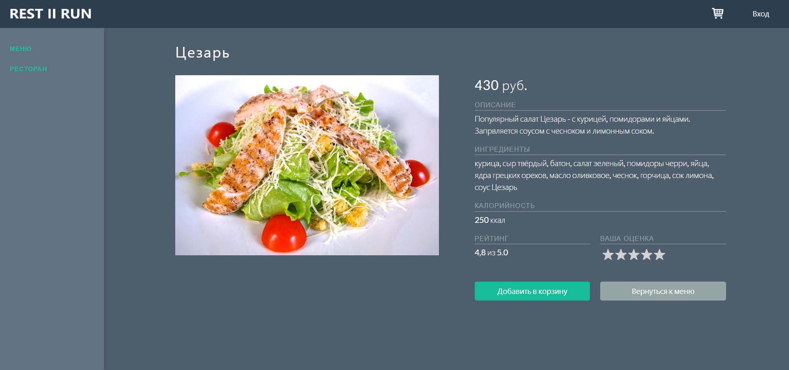
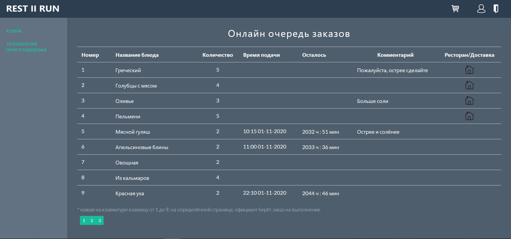
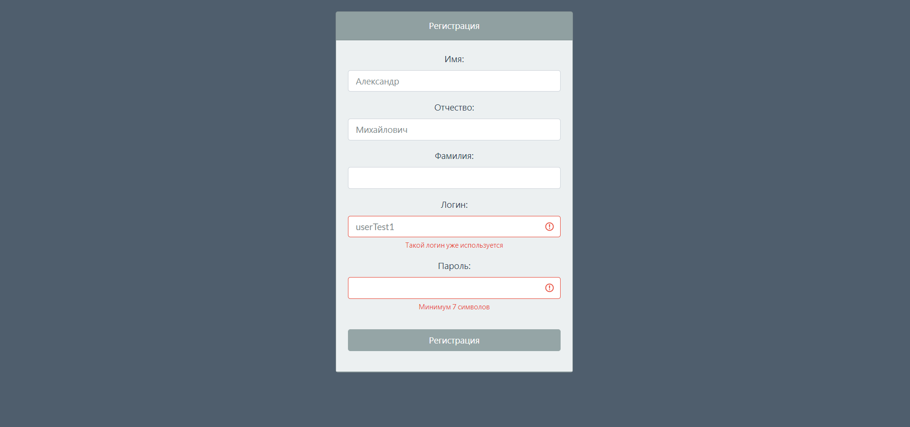

# Restaurant manager project - REST || RUN
> A multifunctional application for ordering food, booking tables and managing a restaurant.

## General info
The application allows the user to order food with delivery, book a table for a specific time in a restaurant, add a pre-order to a booking. There are some functions available for kitchen workers, for instance online queue of orders. The administrator has access to the function of editing dishes.

## Features
Available roles: unregistered user, registered user, kitchen worker, administrator.
- login / registration
- tools for managing user account
- menu - dishes are divided by categories; filters, sorting and pagination are available; separate pages for each dish with rating function
- shopping cart - online editing of cart from menu page; adding comments to the order and for every dish in the cart
- restaurant - available to registered users, the functions of showing free tables for a certain time, the function of booking a table, the function of linking a pre-order to a booking, and managing reservations are available
- kitchen - online tracking of orders, a kitchen worker can take the dishes for processing
- dish editor - available to the administrator, allows editing the main parameters of dishes, as well as their category

To-do list:
- delivery functionality
- tracking of product residuals and automatic ordering of products
- notification 

## Credentials for the website
* Administrator:
    * login: admin1;
    * password: admin1;
* Kitchen:
    * login: kitchen1;
    * password: kitchen1;
* User1:
    * login: userTest1;
    * password: userTest1;
* User2:
    * login: userTest2;
    * password: userTest2;

## Technologies
* Spring Boot (refactored from Spring MVC)
* Spring Security
* Spring JPA, Criteria API
* PostgreSQL
* Liquibase
* Thymeleaf, HTML, CSS, JS, Bootstrap
* Docker

## Status
Project is: in progress

## Screenshots

